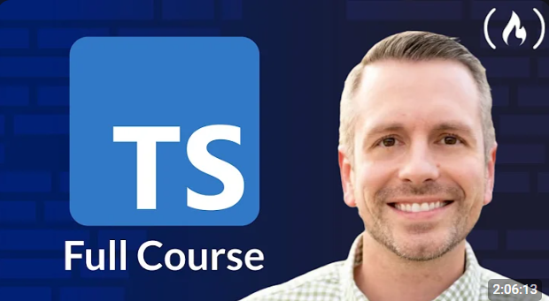

## Learn TypeScript - Full Course for Beginners

This project is based on the [course provided by freeCodeCamp and taught by Bob Ziroll.](https://www.youtube.com/watch?v=SpwzRDUQ1GI)

All the files developed along are stored [here](https://github.com/rebecaaras/fcc-typescript-course).

⭐️ Course Contents ⭐️
- 1 Basic types
- 2 Literal types
- 3 Custom types (objects)
- 4 Typed arrays
- 5 Optional properties
- 6 Unions
- 7 Type narrowing
- 8 Utility types
- 9 Generics

